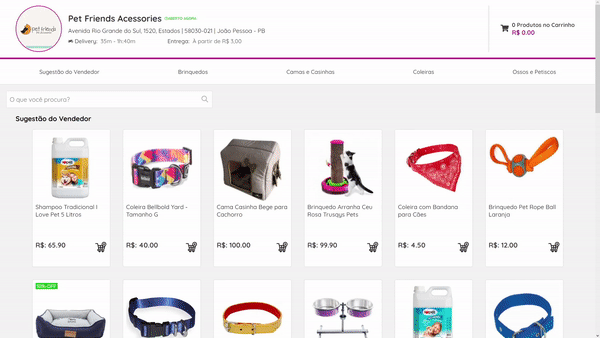

<h1 align="center">Lojinha🛒</h1>

  

 

<h1 align="center">Ferramentas utilizadas</h1>

 
 
 
 
 
 
 
 

 

<h1 align="center">Descrição do projeto</h1>

Projeto de uma Lojinha desenvolvido como um desafio para uma vaga de desenvolvimento front-end React.

 

<h1 align="center">Detalhes</h1>

Front-End: projeto foi desenvolvido em ReactJS adotando a estratégia da utilização do React-Redux para atualizações do estado da aplicação.

 

Back-End: projeto foi desenvolvido utizando NodeJS.

 

SGBD: MySql utilizando a linguagem ORM (Sequelize).

 

<strong>Atenção: ⚠</strong>

    <ul>

  <li>Rodar <strong>yarn install</strong> para instalar as dependências tanto no back-end quanto no front-end;</li>
  <li>Rodar <strong>yarn start</strong> para rodar a palicação tanto no back-end quanto no front-end;</li>
  <li>Script do banco de dados está incluso no repositório para facilictar a construção do mesmo.</li>

  </ul>

 

<h1 align="center">Você pode me encontar nas redes</h1>

  
  

 

<h1 align="center">Gostou?</h1>

Por favor, deixa uma ⭐

 

---

Atenciosamente: Yuri Christian (Namikoka).

